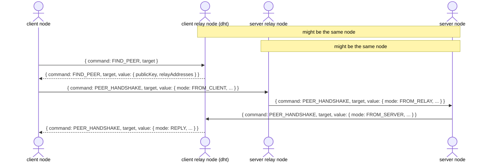
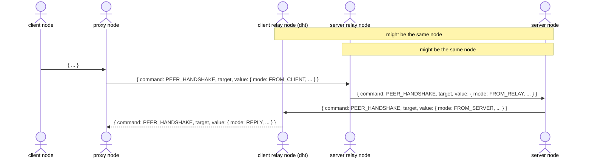
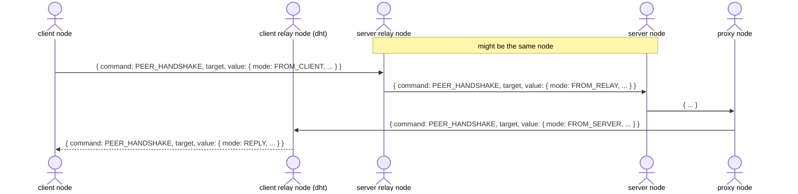

## Handshake

To establish a connection between a client node and a server node, a handshake is performed with two intermediary relay nodes; one chosen by the client and one chosen by the server. During the handshake, the client and server don't interact directly, but instead communicate through the intermediary relay nodes.

Prior to the handshake, the client node will issue a DHT query to locate the server node. If the chosen relay node does not know about the server node, it will instead forward the query to another node closer to the server node.

Once the server node and its chosen relay node have been identified, the client node will begin the handshake by issuing a DHT query to the server relay node. The relay node forwards this query to the server node, which in turn forwards the query back to the chosen client relay node. The client relay node finally replies back to the client node with the address of the server node.

Note that in the event that either of the relay nodes are also the server node, they will simply skip directly to final handshake reply and not send the intermediate handshake messages.

As a result of the handshake:

- the client node has a firewall session with its own relay node and the server relay node; and
- the server node has a firewall session with its own relay node and the client relay node.

The client node may then begin holepunching a connection directly to the server node as it now knows its address.

### Proxying

> :warning: This is a draft of an upcoming proxy protocol that allows a peer to connect to another peer through a proxy node. This may be beneficial if the peer determines network conditions between itself and the other peer unfavorable, but knows of another node that may have a better chance of holepunching a direct connection to the other peer.

#### Client

#### Server

