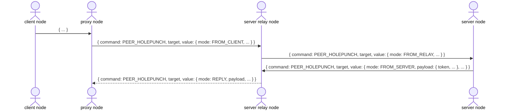
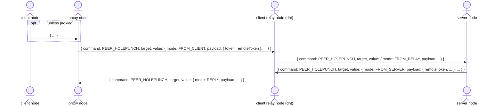
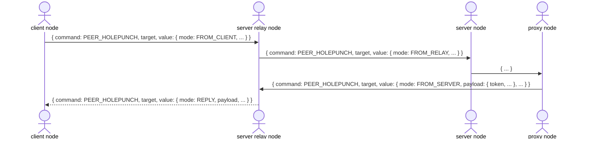
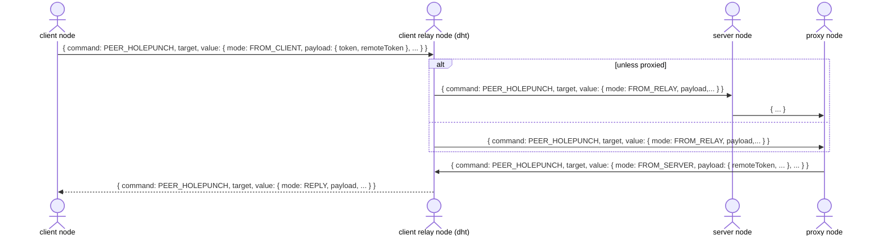

## Holepunch

After the [handshake](handshake.md) completes, the client may attempt to holepunch a direct connection to the server. Prior to this, the client checks if it has already established a direction connection to the server; this will be the case if the server also acted as the relay node during the handshake.

In tandem with the holepunch messages, the client and server will attempt to ping what they believe to be the address of the other peer. The holepunch messages provide feedback to each peer of the network conditions of the other, including additional addresses that they may attempt to holepunch to. The process ends when both peers have received a ping from the other and a direction connection has then been established.

### Proxying

> :warning: This is a draft of an upcoming proxy protocol that allows a peer to connect to another peer through a proxy node. This may be beneficial if the peer determines network conditions between itself and the other peer unfavorable, but knows of another node that may have a better chance of holepunching a direct connection to the other peer.

#### Client

#### Server

